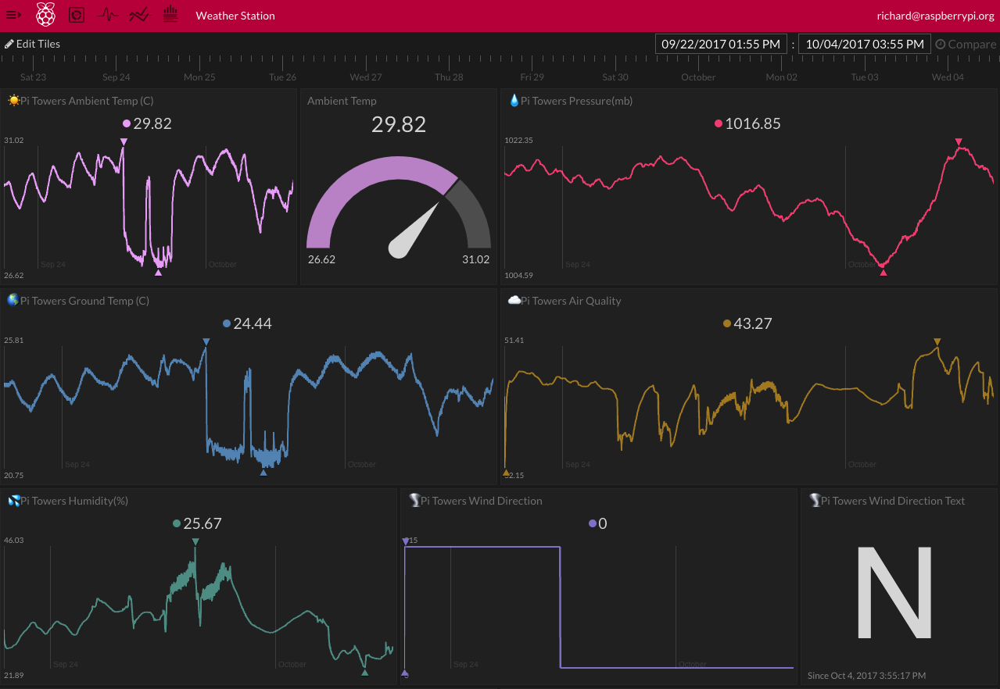

## Introduction

The Raspberry Pi Oracle Weather Station allows you to collect weather data using a variety of sensors. It was designed for use in schools to enable students to create their own weather station, and there is a range of resources to support its use.

As well as logging data locally, schools that received a free Weather Station as part of the 2016 scheme can log their data in a central Oracle database, so they can share information and collaborate with other schools around the world.

Once you're collecting data with your Weather Station, an easy way to see how the climate is changing and to identify patterns is through graphs and visualisations.

[Initial State](https://www.initialstate.com/){:target="_blank"} is an online platform to which you can stream time series data (from sensors, devices, software, files, and anything capable of making an HTTPS request) in order to visualise it. Streaming data to your Initial State account allows you to use colourful, customisable dashboards to see what you are recording happening in real time.

Our friends at Initial State have kindly provided a dedicated white-label platform just for Oracle Weather Station users.

### What you will make

You will write Python code to upload Weather Station data to Initial State and build simple dashboards to display, analyse and share it.

### What you will learn

This project covers elements from the following strands of the [Raspberry Pi Digital Making Curriculum](http://rpf.io/curriculum){:target="_blank"}:

+ [Apply abstraction and decomposition to solve more complex problem](https://curriculum.raspberrypi.org/programming/developer/){:target="_blank"}
+ [Process input data to monitor or react to the environment](https://www.raspberrypi.org/curriculum/physical-computing/developer){:target="_blank"}
