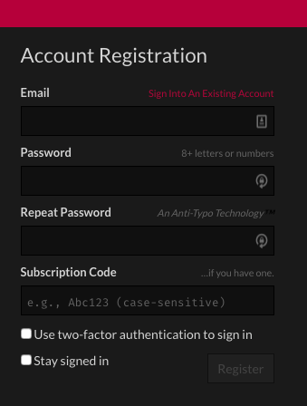
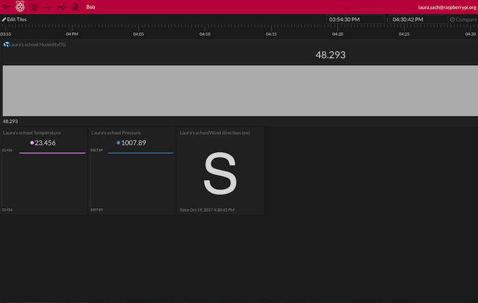
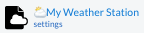
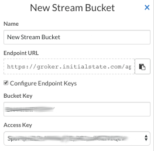

## Registering with Initial State

- To complete your registration, follow [this link](https://rpi.hosted-app.com/#/register/){:target="_blank"} and fill in your email address, choose a password and  then type your **subscription code** into the bottom box. If possible, please use the same email address that you used to register with the Oracle online database.

### Add a Bucket to store your data

On Initial State, every set of data needs a **Bucket** in which it is stored. Once you're logged in, create a new **bucket** to which you will stream your Weather Station data.

- If it is not already open, click on the **show/hide the shelf** button in the top left hand corner of the window. 

- Then click on the **Create stream bucket** button. 

- Give your new bucket a descriptive name. Note that you can use [Emojis to decorate and brighten up your dashboard](http://support.initialstate.com/knowledgebase/articles/667693-emojis){:target="_blank"}. For example, adding `:partly_sunny:` to the bucket name will place a weather symbol next to the text as it is displayed on your Initial State page. You can also use emojis with the names of the various data streams that you upload, as you'll see later.

- Check the **Configure Endpoint Keys** checkbox.

- You'll need your **Bucket Key** and **Access Key** for the next stage when you start writing code. You can either copy-and-paste them into a text file now or come back to this settings screen later.  You should see that the **Access Key** that you were issued with your subscription code matches the one shown on this screen.

- Click on the **Create** button right at the bottom of this pane.
