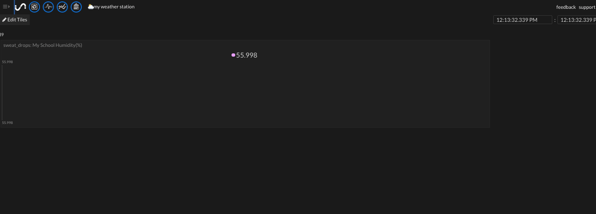
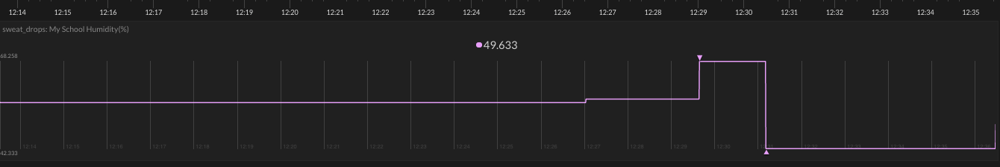
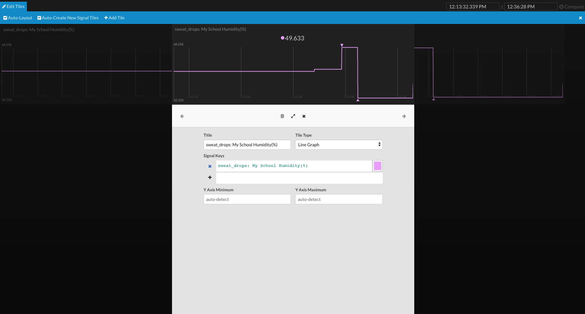
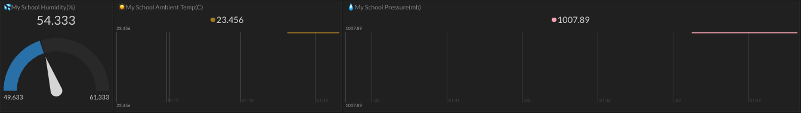

## Uploading data to Initial State

You are going to use the `ISStreamer` Python library to stream data to your Initial State bucket.

- Open a new Python file with IDLE (or your favourite Python IDE), and save it to `/home/pi` as `IS-upload.py`.

 [[[rpi-gui-idle-opening]]]

First of all, import the parts of the `ISStreamer` library that you need, as well as the `os` library.

- Add the following lines at the top of your file:

```python
from ISStreamer.Streamer import Streamer
import os
```

Now you need to develop the code to process each one of your weather readings. For this development stage, rather than using actual sensor measurements, you will create some test data as Python variables.

- Add these lines underneath your library import statements:

```python
humidity = 54.333
ambient_temp = 23.456
pressure = 1007.890
ground_temp = 16.345
wind_speed = 5.6129
wind_gust = 12.9030
wind_average = 180
rainfall = 1.270
```

- Then add some more variables to store the Initial State streaming configuration information. The `BUCKET_NAME` should match the one you used when creating a new Bucket earlier. Replace `XXXX` and `YYYY` with your Initial State keys,  and use your own school name for the `SENSOR_LOCATION_NAME`.

```python

BUCKET_NAME = ":partly_sunny:  My Weather Station"
BUCKET_KEY = 'XXXX' # Replace XXXX with your bucket key
ACCESS_KEY = 'YYYY' # Replace YYYY with your access key
SENSOR_LOCATION_NAME = "My School"
```

Now add the lines of code to stream the data to your Bucket.

- First, create a Streamer instance with the credentials needed for your data bucket.

```python
streamer = Streamer(bucket_name=BUCKET_NAME, bucket_key=BUCKET_KEY, access_key=ACCESS_KEY)
```

### A single data source

- Start with a single measurement to test the process, for example, your humidity reading:

```python
streamer.log(":sweat_drops: " + SENSOR_LOCATION_NAME + " Humidity(%)", humidity)
```

Note that the code above uses the `sweat_drops` emoji for decoration, but you can change this to another image, or omit it altogether.

- Add a line to flush the buffer and send the data.

```python
streamer.flush()
```

- Finally, add a line to indicate that the program has finished.

```python
print("Upload code finished")
```

- Save your file, run your code, and then take a look at your Initial State account. Select the Tiles view, and you should see that a new dashboard element on which a single data point has been plotted.



- One data point isn't very interesting, so change the value of the humidity variable in your code and run your program again.

```python
humidity = 57.078
```

- Repeat this a few more times, changing the humidity value before each round.



- Experiment with different view options by clicking on the **Edit Tile** button in the top right-hand corder and then clicking on the Graph tile. 

- Choose some of the other Tile Type options, and look at the different ways of displaying your data.



The **Gauge** tile type gives a simple display of the latest reading along with the maximum and minimum values received. If you're changing a **Wide Line Graph** tile to a **Gauge** view, then you'll need to shrink its width by clicking the white circles at either end of the tile and dragging inwards.

<iframe width="560" height="315" src="https://www.youtube.com/embed/tolt4mDNE4A" frameborder="0" allowfullscreen></iframe>

### Multiple data sources

- Now add two more `streamer.log` lines to your Python code for your temperature and pressure readings.

---hints---
---hint---
You need to include the name of your measurement and a value to be uploaded. You can also pick an emoji to include.
---/hint---
---hint---
This code will upload a temperature reading:
```python
streamer.log(":sunny: " + SENSOR_LOCATION_NAME + " Ambient Temp (C)", ambient_temp)
```
---/hint---
---hint---
Then add a similar line of code to also upload a pressure reading:
```python

streamer.log(":sunny: " + SENSOR_LOCATION_NAME + " Ambient Temp (C)", ambient_temp)
streamer.log(":droplet: " + SENSOR_LOCATION_NAME + " Pressure(mb)", pressure)
```
---/hint---
---/hints---

- Run your code again. You should now see two more tiles on the dashboard. Note that their 'timeline' begins back when the first humidity data points were uploaded to the Bucket.



### All Weather Station data sources

- Now add the extra lines needed for the rest of the Weather Station sensors. Make sure these are above the `streamer.flush()` line.

---hints---
---hint---
You need a line each for wind direction, wind speed, wind gust, rainfall, ground temperature, and air quality.
---/hint---
---hint---
```python
streamer.log(":cloud_tornado: " + SENSOR_LOCATION_NAME + " Wind Direction", wind_average)
streamer.log(":wind_blowing_face: " + SENSOR_LOCATION_NAME + " Wind Speed", wind_speed)
streamer.log(":wind_blowing_face: " + SENSOR_LOCATION_NAME + " Wind Gust", wind_gust)
streamer.log(":cloud_rain: " + SENSOR_LOCATION_NAME + " Rainfall", rainfall)
streamer.log(":earth_americas: " + SENSOR_LOCATION_NAME + " Ground Temp (C)", ground_temp)
streamer.log(":cloud: " + SENSOR_LOCATION_NAME + " Air Quality", air_quality)
```
---/hint---
---/hints---


### Managing credentials

When you installed the Weather Station software, you might have noticed that there are already a couple of sets of credentials used by Oracle Weather Station scripts: one for the local MariaDB, and one for the online Oracle databases. Rather than being stored directly in the Python code, these credentials are stored as supplementary JSON files. This is good practice, so now that testing is complete, do the same for your Initial State keys.

- Store your Initial State credentials in a JSON file, and change your Python script so that it loads this file to get the credentials.

---hints---
---hint---
Create a JSON file called `credentials.initialstate`, and populate it with the Bucket Key and Access Key:

```json
{
"BUCKET_KEY": "XXXX",
"ACCESS_KEY": "YYYY"
}
```
---/hint---
---hint---
Add the following lines to your code:
```python
credentials_file = os.path.join(os.path.dirname(__file__), "credentials.initialstate")
f_is = open(credentials_file, "r")
credentials_is = json.load(f_is)
f.close()
```
---/hint---
---hint---
Finally, change the Initial State key variables to contain the credentials loaded from the file:
```python
BUCKET_KEY = credentials_is['BUCKET_KEY'] # Replace XXXX with your bucket key
ACCESS_KEY = credentials_is['ACCESS_KEY']
```
---/hint---
---/hints---

- Test that your code still uploads data successfully.
