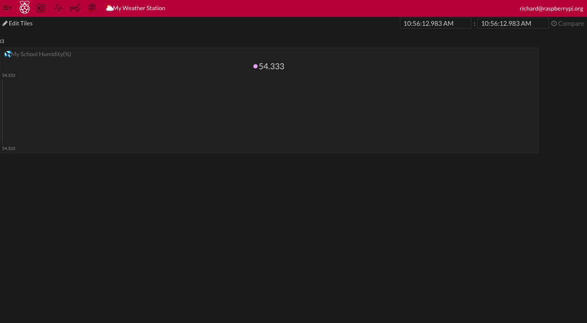
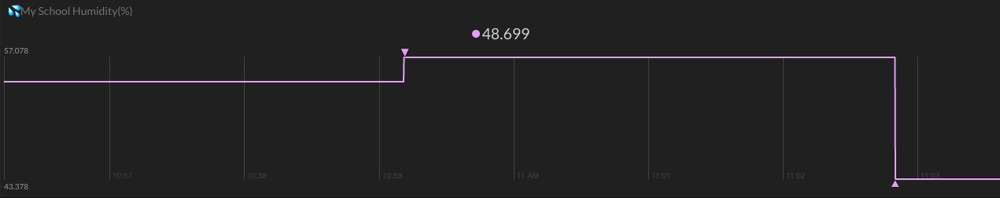
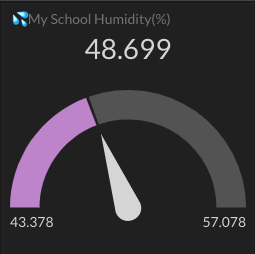
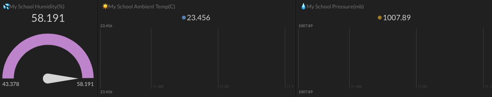
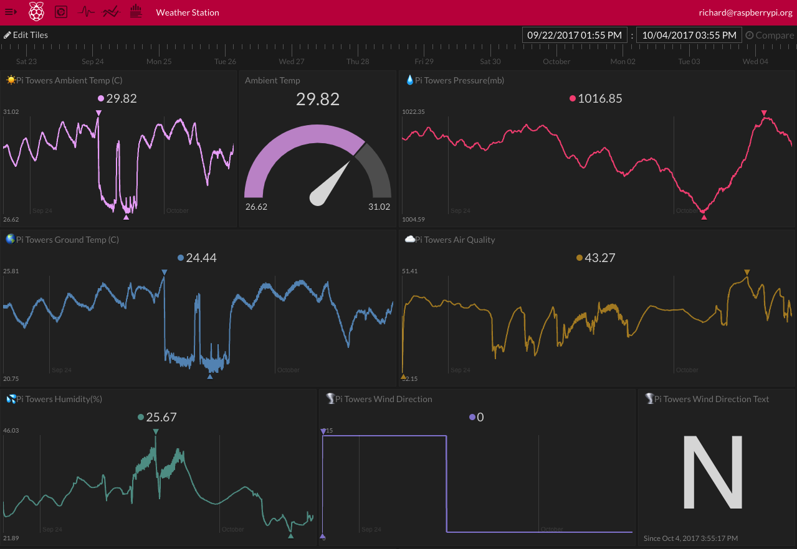

## Uploading data to Initial State

You are going to use the `ISStreamer` Python library to stream data to your Initial State bucket.

- Open a new Python file with Idle (or your favourite Python IDE) and save it into /home/pi as `IS-upload.py`.

 [[[rpi-gui-idle-opening]]]

-  First of all, import the parts of the `ISStreamer` library that you need. Add this line at the top. You'll also use the `os` library later so import that too.

```python
from ISStreamer.Streamer import Streamer
import os
```

- Now you need to develop the code to process each one of your weather readings. Rather than use actual measurements from your sensors during this development stage, create some test data as Python variables. Add these lines underneath your library imports.

```python
humidity = 54.333
ambient_temp = 23.456
pressure = 1007.890
ground_temp = 16.345
wind_speed = 5.6129
wind_gust = 12.9030
wind_average = 180
rainfall = 1.270
```

- Then add some more variables to store the Initial State streaming configuration information. The `BUCKET_NAME` should match the one you used when creating a new bucket earlier. Replace `XXXX` and `YYYY` with your Initial State keys and use your own school name for the `SENSOR_LOCATION_NAME`.

```python

BUCKET_NAME = ":partly_sunny:  My Weather Station"
BUCKET_KEY = 'XXXX' # Replace XXXX with your bucket key
ACCESS_KEY = 'YYYY' # Replace YYYY with your access key
SENSOR_LOCATION_NAME = "My School"
```


Now add the lines of code to stream the data up into our bucket.

- First, create a Streamer instance with the credentials needed for your data bucket.

```python
streamer = Streamer(bucket_name=BUCKET_NAME, bucket_key=BUCKET_KEY, access_key=ACCESS_KEY)
```

- Start with a single measurement to test the process. For example, your humidity readings.

```python
streamer.log(":sweat_drops: " + SENSOR_LOCATION_NAME + " Humidity(%)", humidity)
```

- Note that the code above uses the `sweat_drops` emoji, but you can change this to another image, or omit it altogether.

- Add a line to flush the buffer and send the data.

```python
streamer.flush()
```

- Finally, add a line to indicate that the program has finished.

```python
print("Upload code finished")
```

- Save your file, run your code and then take a look at your Initial State account. Select the Tiles view and you should see that a new dashboard element has appear and a single data point has been plotted.



- One data point isn't very interesting, so change the value of the humidity variable in your code and run your program again.

```python
humidity = 57.078
```

- Repeat this a few more times, changing the humidity value varying the time between each iteration.



- You can experiment with different view options by clicking on the **Edit Tile** button in the top right and then clicking on the graph tile. 

- Choose some of the other Tile Type options and look at the different ways of displaying your data.


- The **Gauge** Tile type gives a simple display of the latest reading along with the maximum and minimum values received.

<iframe width="560" height="315" src="https://www.youtube.com/embed/vH9iibNk9ZM" frameborder="0" allowfullscreen></iframe>

If you're changing a wide line view tile to a gauge view then you'll need to shrink the width by clicking the white circles at either end of the tile and dragging inwards.



- Now add two more `streamer.log` lines to your Python code for your temperature and pressure readings.

---hints---
---hint---
You need to include the name of your measurement and a value to be uploaded. You can also pick an emoji to include.
---/hint---
---hint---
This code will upload a temperature reading:
```python
streamer.log(":sunny: " + SENSOR_LOCATION_NAME + " Ambient Temp (C)", ambient_temp)
```
---/hint---
---hint---
Then add a similar line of code to also upload a pressure reading:
```python

streamer.log(":sunny: " + SENSOR_LOCATION_NAME + " Ambient Temp (C)", ambient_temp)
streamer.log(":droplet: " + SENSOR_LOCATION_NAME + " Pressure(mb)", pressure)
```
---/hint---
---/hints---

- Run your code again. You should now see that two more tiles are created on the dashboard. Note that their 'timeline' begins back when the first humidity data points were uploaded to the bucket.



- Now add the extra lines needed for the rest of the Weather Station sensors. Make sure these are before the `streamer.flush()` line.

---hints---
---hint---
You need a line for wind direction, speed and gust measurements, rainfall, ground temperature and air quality.
---/hint---
---hint---
```python
streamer.log(":cloud_tornado: " + SENSOR_LOCATION_NAME + " Wind Direction", wind_average)
streamer.log(":wind_blowing_face: " + SENSOR_LOCATION_NAME + " Wind Speed", wind_speed)
streamer.log(":wind_blowing_face: " + SENSOR_LOCATION_NAME + " Wind Gust", wind_gust)
streamer.log(":cloud_rain: " + SENSOR_LOCATION_NAME + " Rainfall", rainfall)
streamer.log(":earth_americas: " + SENSOR_LOCATION_NAME + " Ground Temp (C)", ground_temp)
streamer.log(":cloud: " + SENSOR_LOCATION_NAME + " Air Quality", air_quality)
```
---/hint---
---/hints---



- When you installed the Weather Station software, you will have noticed that there are already a couple of sets of credentials used by Oracle Weather Station scripts, for the local MariaDB and the online Oracle databases. Rather than store these directly in the Python code itself, these are stored as supplementary JSON files. This is good practice so now that testing is complete, do the same for the Initial State keys.   

---hints---
---hint---
Create a file called `credentials.initialstate` and populate it with the bucket and access keys:

```json
{
"BUCKET_KEY": "XXXX",
"ACCESS_KEY": "YYYY"
}
```
---/hint---
---hint---
Add the following lines to your code:
```python
credentials_file = os.path.join(os.path.dirname(__file__), "credentials.initialstate")
f_is = open(credentials_file, "r")
credentials_is = json.load(f_is)
f.close()
```
---/hint---
---hint---
Finally, change the Initial State key variables to contain the credentials loaded from the file:
```python
BUCKET_KEY = credentials_is['BUCKET_KEY'] # Replace XXXX with your bucket key
ACCESS_KEY = credentials_is['ACCESS_KEY']
```
---/hint---
---/hints---

- Test that your code still uploads successfully.
