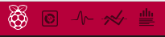
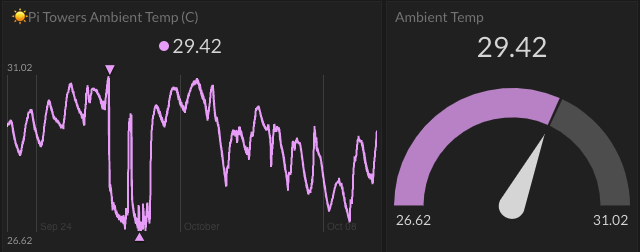
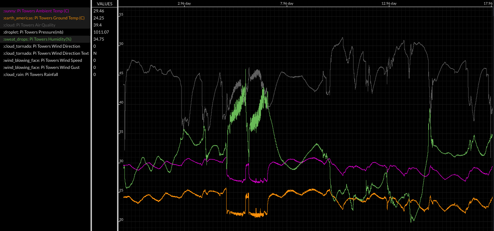
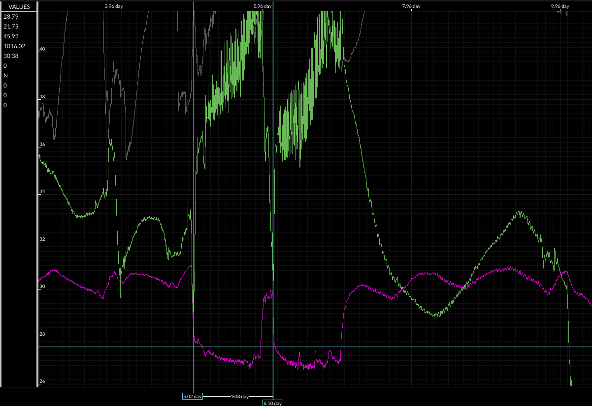
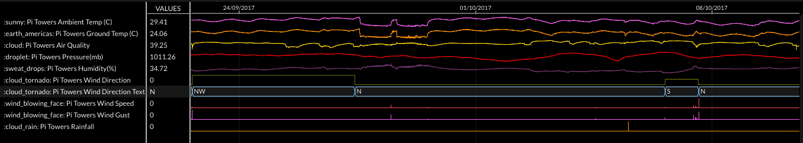
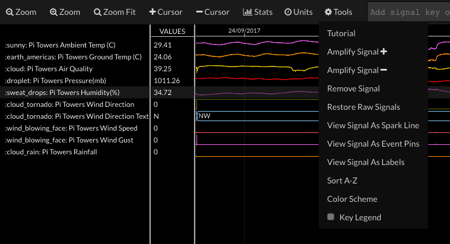
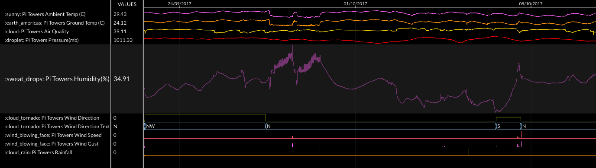
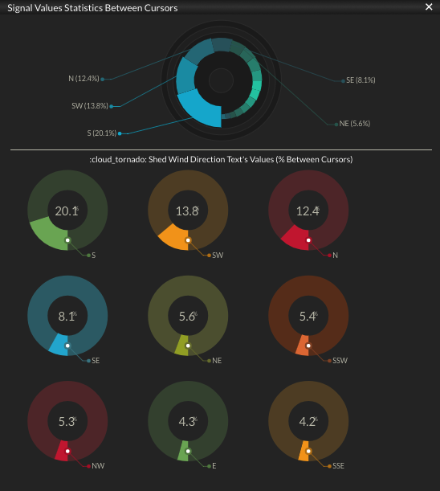

## Visualising your data
There are four main display views in Initial State which will help you to visualise and understand your data in different ways.

Choose between the different views using the button in the top left-hand corner of a Bucket's page.

### Tiles view 

This is the general dashboard view you have already seen. You can display each data stream using a different dashboard widget, and even have multiple views of the same data stream (for example, you can have a gauge view alongside a line graph for ambient temperature).

### Source view 

The Source view is a simple list of every data point uploaded to your bucket. This can be useful for debugging if there are problems with your upload, and you can also export the list as a CSV file by clicking on the **Save As File** button.

### Lines view 

This is an interactive stacked line graph view. You can examine multiple numerical-based signals on a shared x-y axis. This makes it easy to measure time and magnitude differences and spot correlations between data.

In the example below are overlaid plots of ground temperature, ambient temperature. humidity, and air quality. On the far left of the timeline, there is a clear correlation between the two temperature values, as you'd expect. However, you can also see an inverse correlation between humidity and temperature: humidity rises to a maximum when the temperature is at its lowest.

Towards the centre of the plot you can see a change in the pattern with much larger variations in amplitude of these measurements.

You can zoom in on a particular region of the plot and measure the differences in values using the cursors (add a cursor from the Tools menu). In the example below, you can see from the blue cursor lines that the time separation between the spikes in temperature (and corresponding sharp dips in humidity) is almost exactly one day.

Note that you can set the time units in which x-axis values are presented via the **Units** menu.

### Waves view 

This option gives you an interactive multi-row waveform viewer. You can examine your data in more detail by zooming in/out, collecting targeted statistics, and moving signals around.

How data is displayed depends on what type of data you upload. All of your Oracle Weather Station data is numerical, except for the cardinal wind direction values, which are strings.

The default layout for the Waves view is for all data streams to be the same height.

You can make any single stream larger by selecting it so that it is highlighted, and then clicking on the **Tools** menu section and choosing **Amplify Signal +**.

The more times you click, the taller that stream's plot will become. In the example below, the humidity plot has been amplified to reveal more detail.

For data that represented as strings, such as the wind direction, the **Signal Stats** option from the **Stats** menu section is a great way of seeing for how much time particular value has been measured.

In the example below, you can see that most common wind direction is from the South or South West (which is what you would expect, or at least hope for, during summer in the UK).

